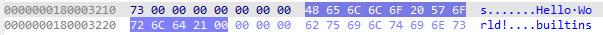

# ATFieldDRM
* ATFieldDRM은 Absolute Terror Field DRM의 약자로 파이썬 코드를 XOR 연산을 사용하여 암호화하고 C 확장 모듈로 복호화 후 실행합니다.
* Stable ABI를 사용해 디펜던시를 최소화하여 빌드를 진행한 파이썬 버전이 아니어도 파이썬 3.2 이상이면 어느 버전에서도 실행 가능합니다.

## 빌드
* 키를 KEK로 암호화하지 않고 빌드를 진행할 경우 build_ext.py가 아닌 build.py를 사용할 수 있습니다.
```
cd src
python build.py build
```
> ⚠️ 단, 이 경우 암호화되지 않은 키가 .rdata 섹션 시작 부분에 평문으로 포함되어 리버스 엔지니어링 도구에서 쉽게 노출되므로 권장하지 않습니다.

